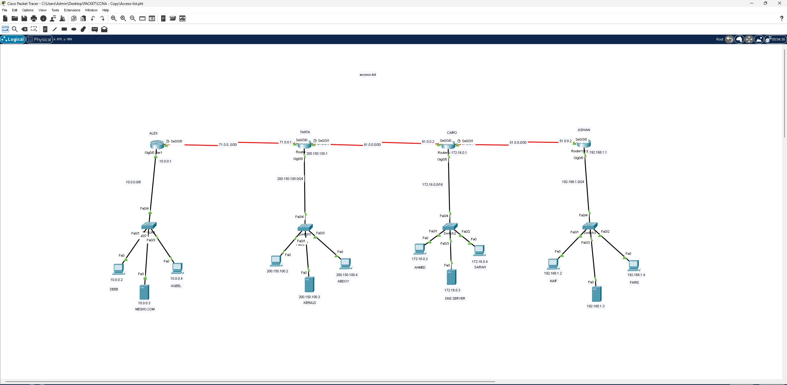

# ACCESS-LIST
# Access List (ACL) – ربط 4 مدن بشبكة WAN

## 📖 الوصف
مشروع يحاكي شبكة WAN تربط 4 مواقع (مدن) بروابط Serial، مع تطبيق **Access Control Lists** للتحكم في حركة المرور بين الشبكات المختلفة.

## 🗺️ التصميم (Topology)

الشبكة تتكون من 4 مواقع رئيسية متصلة بروابط تسلسلية (Serial):

| الموقع | الراوتر | الشبكة المحلية | الأجهزة |
|--------|---------|----------------|---------|
| ALEX | Router0 | `10.0.0.0/8` | DEEB, AQEEL, MESHO.COM (Server) |
| TANTA | Router1 | `200.150.100.0/24` | KERIAZI, ABDOY, Server |
| CAIRO | Router (Cairo) | `172.16.0.0/16` | AHMED, SARAH, DNS SERVER |
| ASWAN | Router (Aswan) | `192.168.1.0/24` | NAIF, FARIS + سيرفر |

### روابط WAN بين المواقع
- ALEX ↔ TANTA: `71.0.0.0/30`
- TANTA ↔ CAIRO: `61.0.0.0/30`
- CAIRO ↔ ASWAN: `51.0.0.0/30`

## ⚙️ المفاهيم المطبقة
- تصميم شبكة WAN متعددة المواقع (Serial Links)
- عناوين IP بأصناف مختلفة (Class A, B, C) لكل موقع
- إعداد Standard/Extended Access Lists للتحكم بالوصول بين الشبكات
- التوجيه بين الراوترات (Routing) لضمان اتصال المواقع الأربعة

## 🎯 الهدف من المشروع
تطبيق عملي على كيفية تقييد أو السماح لحركة المرور بين شبكات محلية مختلفة عبر شبكة WAN باستخدام Access Lists، وهو من أهم مواضيع أمان الشبكات في منهج CCNA.

## 📂 الملف
- [`Access-list.pkt`](./Access-list.pkt) — ملف Packet Tracer الكامل
